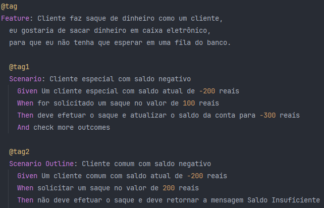

# AF TESTES DE SOFTWARE conta bancária (CUCUMBER)
## Descrição
O projeto foi desenvolvido na IDE IntelliJ, consiste em um código simples para colocar em prova o conhecimento em testes de software, onde é utilizado o Cucumber e jUnit.

## Funcionalidades
Realização de testes via Cucumber + jUnit.

## JavaDoc
Toda documentação do código é gerada via JavaDoc.

## Publicação
https://github.com/Rafael-MJ/TQS-ContaBancaria

## Última atualização 27/11/23
